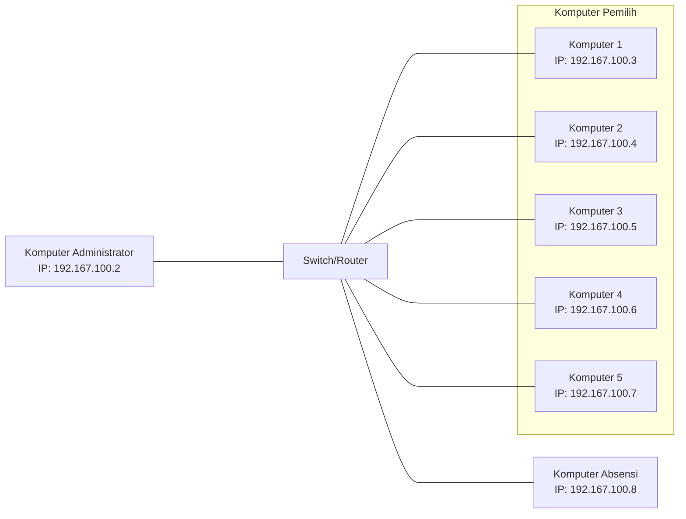

```mermaid
graph LR
   A[Komputer Administrator<br />IP: 192.167.100.2]
   B[Switch/Router<br />]

   subgraph Komputer Pemilih
   C[Komputer 1<br />IP: 192.167.100.3]
   D[Komputer 2<br />IP: 192.167.100.4]
   E[Komputer 3<br />IP: 192.167.100.5]
   F[Komputer 4<br />IP: 192.167.100.6]
   G[Komputer 5<br />IP: 192.167.100.7]
   end

   H[Komputer Absensi<br />IP: 192.167.100.8]

   A ------ B

   B ------ C
   B ------ D
   B ------ E
   B ------ F
   B ------ G

   B ------ H
```

```sh
ping 192.168.100.2
```
