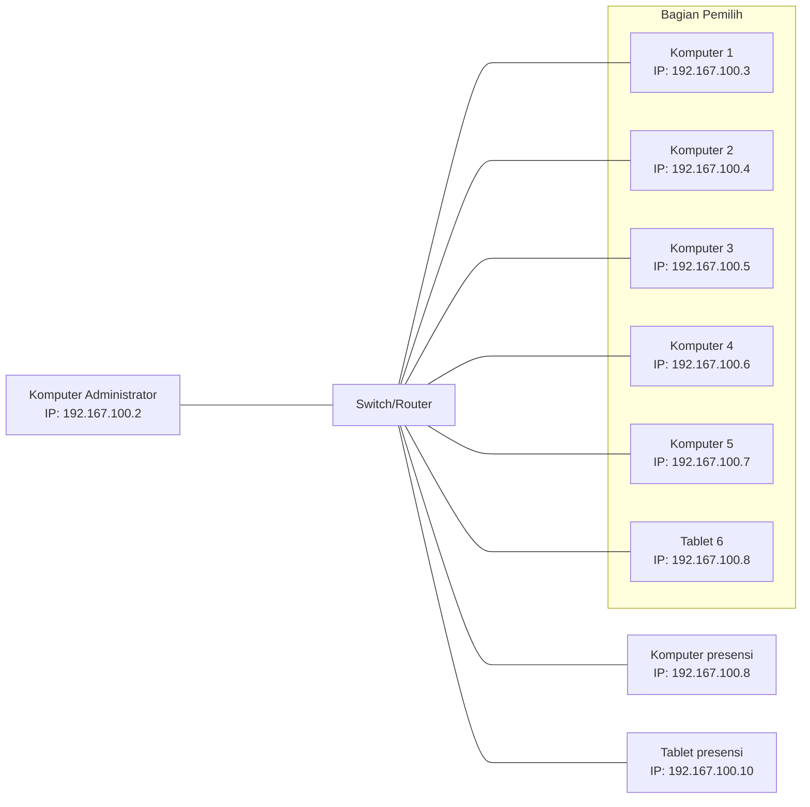

### Perangkat yang Diperlukan

WIP

### Instalasi Perangkat dan Jaringan

Komputer pemilih dapat menggunakan laptop atau komputer bahkan tablet dengan sistem operasi android yang dilengkapi dengan kamera bawaan atau menggunakan kamera eksternal apapun untuk membaca QR Code yang ditunjukkan oleh peserta. Untuk setiap pemilihan, dibutuhkan setidaknya 3 perangkat yaitu komputer administrator, komputer pemilih, dan komputer presensi. Jumlah komputer yang digunakan dapat menyesuaikan ketersediaan perangkat yang ada.

Untuk instalasi jaringan, dapat menggunakan Switch Hub atau Router WiFi. Disarankan menggunakan Switch Hub karena jaringan yang terhubung benar-benar terisolasi dari jaringan luar.

Namun, jika hanya tersedia Router WiFi, ada beberapa hal yang harus dilakukan untuk meningkatkan keamanan, yaitu:

1. Gunakan WPA2/WPA3 dengan password yang acak, tidak mudah ditebak, dan cukup panjang.
2. Matikan akses WPS, karena fitur ini dapat mempermudah penyerang untuk mendapatkan akses ke jaringan.
3. Gunakan daftar putih (whitelist) berdasarkan MAC address untuk membatasi akses ke jaringan hanya pada perangkat yang diizinkan.
4. Batasi jangkauan jaringan sesuai dengan kondisi lapangan, jika router WiFi memiliki fitur ini.

Jika dibuatkan diagram, instalasi jaringan akan terlihat seperti ini:



Kemudian cek konektivitas dari semua komputer pemilih dan komputer absensi, apakah berhasil terhubung atau tidak. Caranya tinggal menggunakan command ping.

Asumsikan komputer administrator berjalan pada alamat IP `192.168.100.2`, berarti jalankan perintah dibawah ini.

```sh
ping 192.168.100.2
```

### Instalasi Pada Tablet Android

Aplikasi ini juga dapat berjalan pada tablet android jika panitia menginginkan penggunaan tablet supaya presensi maupun pemilihan dapat menggunakan layar sentuh. Namun memerlukan tunneling sebagai alat enkripsi tambahan, berikut ini tata caranya.

1. ##### Download dan Install Termux
   
   Jangan download termux dari playstore, tapi download dari link https://f-droid.org/repo/com.termux_1021.apk, karena alasan [berikut ini](https://github.com/termux-play-store#background).

   Kalau berhasil terunduh, langsung install saja. Jika mengalami kegagalan, mungkin penyimpanan perangkat anda penuh dengan file yang lain.

2. ##### Update semua package

   Pertama-tama, update semua package dan dependensi yang ada supaya tidak ada versi yang usang.

   ```sh
   pkg update && pkg upgrade -y
   ```

3. ##### Install OpenSSH Client

   Jalankan perintah berikut ini untuk mengunduh dan install `openssh`.

   ```sh
   pkg instal openssh
   ```

4. ##### Lakukan Ping dan Cek Instalasi OpenSSH

   Untuk mengecek apakah tablet dapat berkomunikasi dengan komputer server, terlebih dahulu lakukan perintah ping dan memasukkan alamat IP server. Dalam contoh ini, `192.168.100.2` adalah IP dari servernya.

   ```sh
   ping 192.168.100.2
   ```

   Kemudian apabila tidak ada packet loss, maka koneksi sudah aman. Kemudian, jalankan perintah berikut ini untuk mengecek apakah ssh terinstall dengan benar atau tidak.

   ```sh
   ssh
   ```

   Jika tampil seperti gambah dibawah, maka instalasi dinyatakan berhasil.

   <div class="flex flex-col justify-center items-center gap-2">
      
   </div>